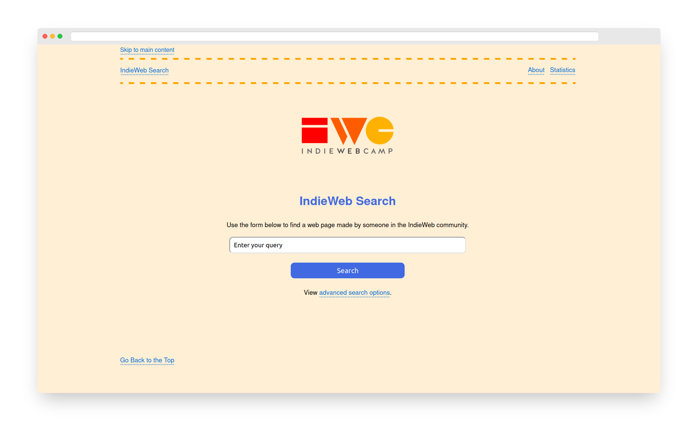

# IndieWeb Search Engine

This repository contains the source code for the indieweb-search crawler and web application.

All files in the `crawler/` directory relate to the web crawler. All files in the main directory relate to the web application.

The search engine is available at [indieweb-search.jamesg.blog](https://indieweb-search.jamesg.blog).

Further documentation on the search engine is available on the [IndieWeb wiki](https://indieweb.org/IndieWeb_Search).

*Please note that this project is still in active development and there may be many bugs present. This project is a fork of my personal website search engine and is currently being tweaked to meet the needs of indexing other sites.*

## Screenshot

## Installation Instructions

You can install the required dependencies to run this project by running the following command:

    pip install -r requirements.txt

You may encounter errors when setting up the project that ask you to install nltk or spacy models.

Please read these errors individually and install the packages according to the instructions in the error message.

Documentation on exactly what to install will follow in the future.

## Site Search Support

IndieWeb Search supports searching sites by URL. Read the [Advanced Settings documentation](https://indieweb-search.jamesg.blog/advanced) for information on how to search for a page on a specific website.

## Indexing Content

You can do this by adding a site URL to the `crawl_queue.txt` file and then running this command:

    python3 build_index.py

All content will be saved to `results.json`. This means you can index without having your own Elasticsearch server running.

Your site URL will be removed from the `crawl_queue.txt` file after your site has been fully crawled.

All crawls are limited to 1,000 URLs. To change this limit, search for "1000" in the `crawler/url_handling.py` file and change the value to the desired limit.

You can run the crawler in the background using this command:

    nohup python3 build_index.py &

Running the crawler in the background is only recommended once you have crawled at least one site and made sure you have not encountered any errors.

### Configuration

Please create a `config.py` file in the root directory of this project before running the application for the first time.

The config.py file should contain the following variables:

    import os

    HEADERS = {
        "User-agent": "indieweb-search",
        "Accept": "text/html, application/xhtml+xml, text/xml, */*" # used for content negotiation
    }

    ROOT_DIRECTORY = os.path.dirname(os.path.abspath("__init__.py"))

    SECRET_KEY = os.urandom(24)

    ELASTICSEARCH_PASSWORD = "YOUR_ELASTICSEARCH_PASSWORD"

    ELASTICSEARCH_API_TOKEN = "YOUR_ELASTICSEARCH_API_TOKEN"

    MYSQL_DB_USER = "YOUR_MYSQL_DB_USERNAME"

    MYSQL_DB_PASSWORD = "YOUR_MYSQL_DB_PASSWORD"

The official indieweb-search engine uses indieweb-search as the user agent. Please choose another user agent if you use this crawler.

## Running the Web Application

To run the web application, execute these commands:

    export FLASK_APP=.
    flask seed build-tables
    flask run

You will not be able to run the web application without having a server running the `elasticsearch_server.py` that has some indexed files.

## Running the Elasticsearch Application

This project uses Elasticsearch for indexing content. To make use of the Elasticsearch back-end server provided by this project -- which is integrated into many of the ingestion and helper scripts -- please install Elasticsearch and run the `elasticsearch_server.py` file as a web server.

You should have a copy of your `config.py` file in the root directory of your Elasticsearch web server. This is important because the Elasticsearch web server provided by this application relies on many of the same configuration values in the `config.py` file that the main application uses.

You will also need MySQL installed on the same server you use to run your Elasticsearch web server.

With MySQL and Elasticsearch installed, run the following command on your Elasticsearch web server:

    python3 seed.py

This command will seed the MySQL database with the tables you need to run the web server.

Now you are ready to run the `elasticsearch_server.py` script:

    python3 elasticsearch_server.py

## Direct Answer Search Results

Work is being done to support some "direct answer" search results. These are search results that aim to provide an immediate answer to your query before you click on a search result.

The main "direct answers" that are in development are:

- Answering questions with an answer (triggered by `what is [your query]`). This type of direct answer currently relies on answers from the IndieWeb wiki.
- Showing the h-card of a domain (triggered by `who is [domain-name]`).
- Identifying names of people, places, and organizations.
    - This is a long-term project and only source code from capjamesg's personal search engine is currently in the project.
- Showing recipes marked up with h-recipe.
- Showing reviews marked up with h-review.
- Showing events marked up with h-event.
- Displaying feeds associated with a page.
- Showing all rel=me links on a site's home page.

## Image Search Results

While image search results are supported in the codebase, they are not currently in development or in use on the IndieWeb search site.

Storing and processing images in the way required to support image search results would take away resources from this project's text search capabilities.

## Adding Your Domain to the Index

This repository does not contain a list of any domains indexed in the live search engine.

If you would like to request your site be indexed on indieweb-search.jamesg.blog, please create an issue on this project.

Only contributors to the IndieWeb wiki will be considered at this stage due to the limited compute resources available for this project.

## Search Result API

Results pages from IndieWeb Search are programmatically accessible in two ways:

1. By using the dedicated JSON API flags in the URL of a results page.
2. By parsing the results page with microformats.

Each results page is marked up with the h-feed microformat so you can parse results.

To find out more information about a result, including the raw text stored in the index that corresponds to the result, we recommend using the API.

### JSON API Usage

To use the JSON API, append one of the two flags below to the end of a search result URL:

- `serp_as_json=direct`: Returns the featured snippet displayed in the search result. No more than one featured snippet will be returned.
- `serp_as_json=results_page`: Returns all results displayed in the search result, excluding the featured snippet result.

Here is an example JSON API call:

    https://indieweb-search.jamesg.blog/results?query=what+is+a+web+crawler&serp_as_json=results_page

This API call returns:

- category
- domain
- h1
- h2
- h3
- incoming_links (integer)
- length (whole document length)
- meta_description
- outgoing_links (integer)
- published_on (not always available)
- title
- url
- word_count (integer)

This feature is not currently deployed on production.

## Rich Results

IndieWeb Search may return a rich result for a site. This can happen under a number of circumstances. For example, if a site has a h-card, the h-card will be returned as a rich result in response to a "who is" query. Or if a page is marked up as h-review and a user looks for a review, the review might be returned as a rich result.

Only one rich result can appear per query.

To maximise your chances of getting a rich result, we recommend using semantic HTML in your code.

Some rich results are only available if you use microformats in your code.

These are:

- Reviews: use h-review for a chance to get a rich result for a review.
- Events: use h-event for a chance to get a rich result for an event description.
- Profiles: use h-card for a chance to get a rich result in response to a "who is" query. The h-card must be on your home page.
- Recipes: use h-recipe for a chance to get a rich result for a recipe.

## Recrawling

Recrawling sites is currently in development.

At the moment, this project collects all feeds from a site during a crawl and saves the feeds to the feeds.json file. These feeds are then read in the recrawl.py script which can be executed on demand. The recrawl script looks for any new items in the feed and then indexes them. In addition, the recrawl script looks through all indexed sitemaps and will index the URLs in them. This will help keep more content on a site fresh and ensure that most new pages are discovered and indexed without having to run a full recrawl.

This script is currently set up to run once per day via a cron job on the main project server.

The following feed types can be read by the recrawl script:

- JSON Feed (see [jsonfeed.org](https://jsonfeed.org) for more information)
- RSS feeds
- Atom feeds
- Microformats h-feeds (see [h-feed](https://microformats.org/wiki/h-feed) for more information)

## Contributing

Feel free to contribute to this project no matter how much background you have in search.

Please refer to the Issues page in this repository for a list of features which have been proposed and bugs that need fixed. You can propose your own feature or help work on an existing request.

If you think something is missing from IndieWeb Search that would help you and potentially others, feel free to try your hand at implementing your idea.

## Technology Stack

This project makes use of the following technologies:

- Python
- Flask
- Elasticsearch
- mf2py
- BeautifulSoup
- Spacy
- Textblob
- pytextrank
- pyspellchecker
- feedparser

## Acknowledgements

Thank you to [@snarfed](https://github.com/snarfed) for putting together [IndieMap](https://github.com/snarfed/indie-map), a project that crawled many IndieWeb sites to create a social graph. IndieMap provided inspiration, motivation, and a list of domains from which this project started indexing.

Thank you also to every member of the IndieWeb community. The support from community members is helping to make this search engine more effective.

### Icon Set Attribution

All icons used in featured snippets for "rel me" queries are from Paul Robert Lloyd's [socialmediaicons](https://github.com/paulrobertlloyd/socialmediaicons) repository. These icons are used in accordance with the Creative Commons Attribution-Share Alike 3.0 license under which the icons are licensed. Appropriate attribution is also listed on search pages where the icon set is used.

## License

This project is licensed under the [MIT license](LICENSE).

## Contributors

- capjamesg